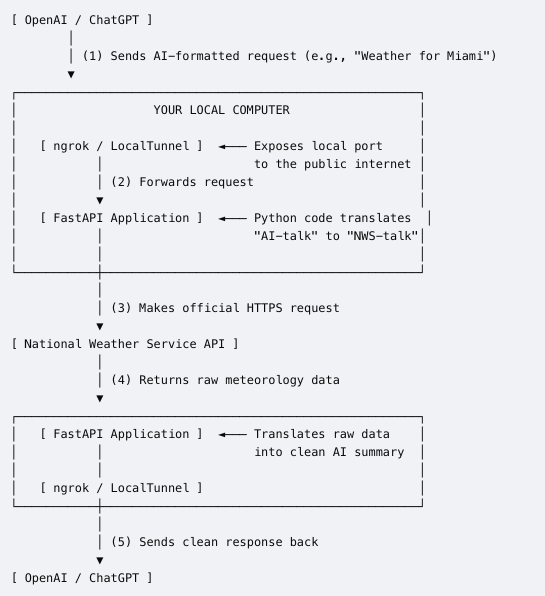

## Hi there 👋

## What am I currently working on?

I'm currently working on two things:

1. Analysis of macro economic time series from Section 1 (GDP) of the National Income and Product Accounts (NIPA - https://www.bea.gov/products/national-income-and-product-accounts). My goal is to detect statisticaly anomlous changes in GDP and its compoments. This is new for me in that the data is not  independent and identically distributed. I am curious if evidence of bear markets appears within the "three month rule" window. If it does, changing positions within the "three month period" might stem losses during a bear market. Repo will be made public in the future.

2. I am learning how to set up a local Python development environment to build, host, and expose an API (e.g., using FastAPI) that translates OpenAI's requests into official National Weather Service (NWS) API calls. The public repo for this project is called GPT-weather-gov. The system architecture is shown below:

 

## How can I be reached?

I can be reached at steven.morin@comcast.net.

<!--
**stagOak/stagOak** is a ✨ _special_ ✨ repository because its `README.md` (this file) appears on your GitHub profile.

Here are some ideas to get you started:

- 🔭 I’m currently working on ...
- 🌱 I’m currently learning ...
- 👯 I’m looking to collaborate on ...
- 🤔 I’m looking for help with ...
- 💬 Ask me about ...
- 📫 How to reach me: ...
- 😄 Pronouns: ...
- ⚡ Fun fact: ...
-->
