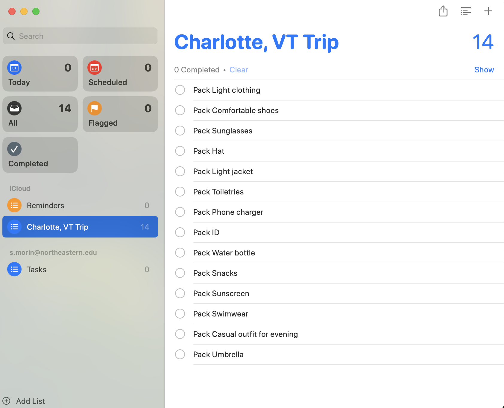
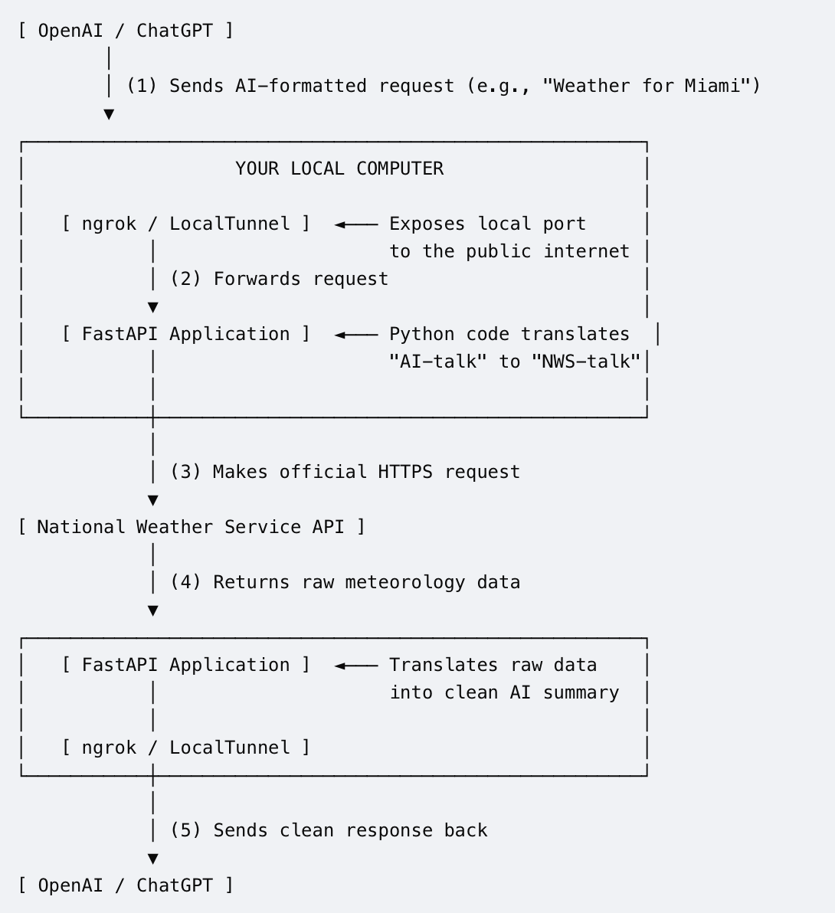

## Hi there 👋

## What am I currently working on?

I'm currently working on two things:

1. Analysis of macro economic time series from Section 1 (GDP) of the National Income and Product Accounts (NIPA - https://www.bea.gov/products/national-income-and-product-accounts). My goal is to detect statisticaly anomlous changes in GDP and its compoments. This is new for me in that the data is not  independent and identically distributed. I am curious if evidence of bear markets appears within the "three month rule" window. If it does, changing positions within the "three month period" might stem losses during a bear market. Repo will be made public in the future.

## Recent Projects Completed

1. This project provides a simple example of Master Tool-Chaining (The Gateway to Workflows). Automated workflows rely on one tool feeding data directly into another.  The Concept: The GPT calls Tool A, processes the output, and automatically feeds it into Tool B without user intervention. This is a practice project. ChatGPT is used once to generate a packing list. The destination weather forecast is sent to ChatGPT with a prompt. The ChatGPT response is a packing list that reflects the weather forecast. The public repo for this project is called Travel-Planner-App. The system architecture is shown below:

A sample Apple Reminder packing list is shown below:

2. GPT Plug-In. I built a weather forecasting application and connected it to a local server. I exposed it to my Custom GPT (client) using an HTTP gateway. It translates OpenAI's requests into official National Weather Service (NWS) API calls. The public repo for this project is called GPT-weather-gov. The system architecture is shown below:

Here is a chat using the GPT Plug-In:

## How can I be reached?

I can be reached at steven.morin@comcast.net.
